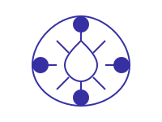
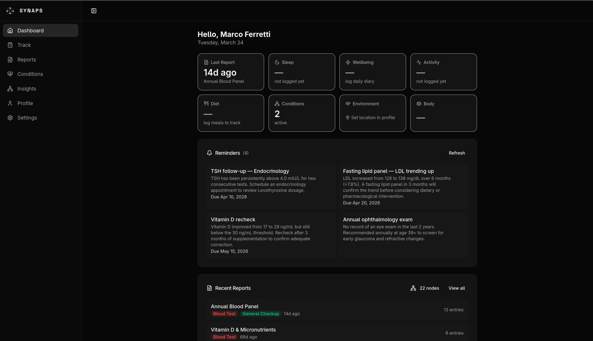
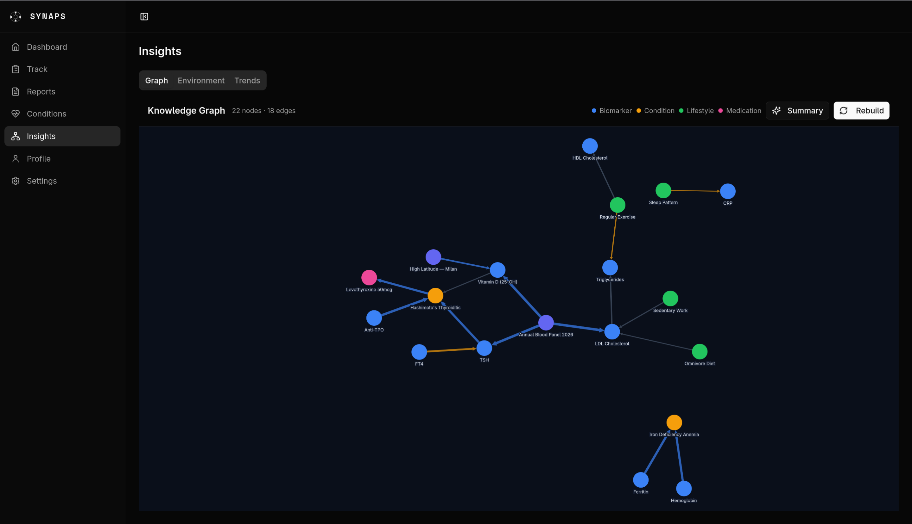
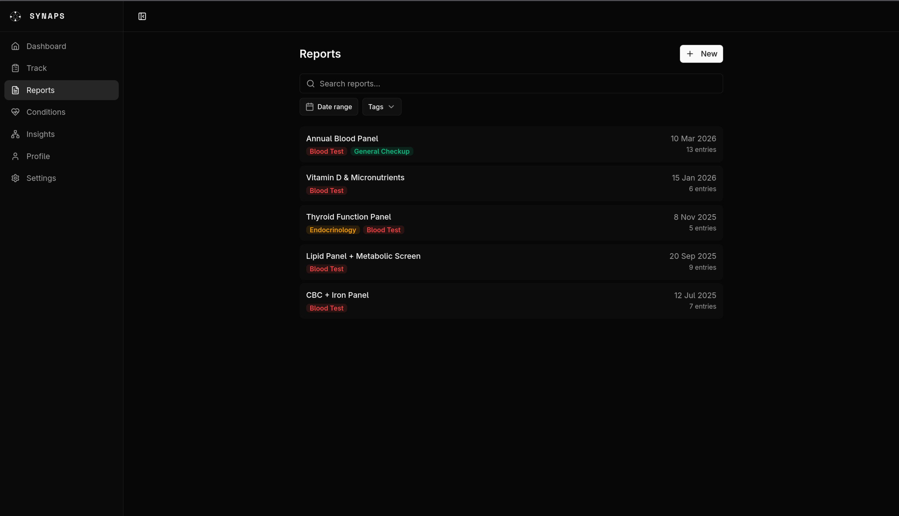
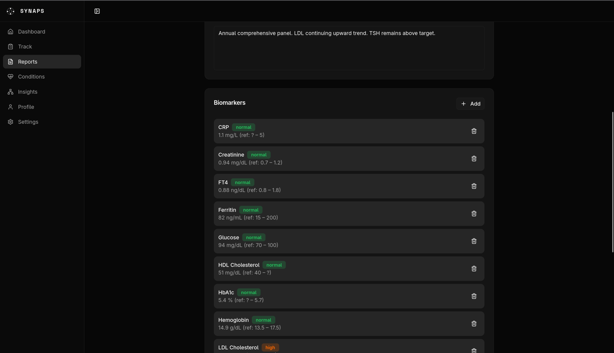
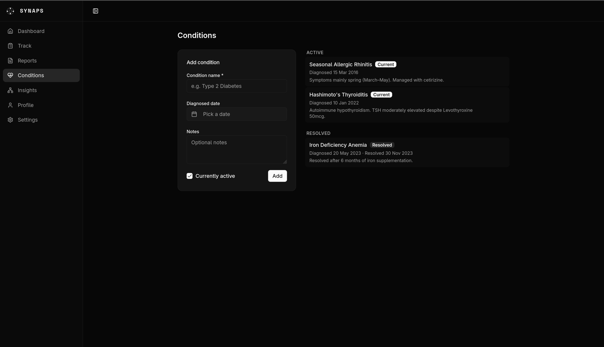
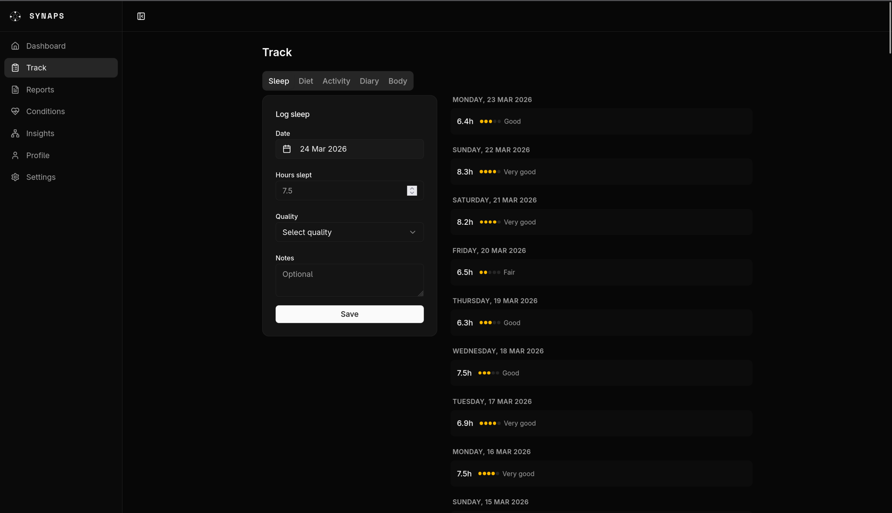
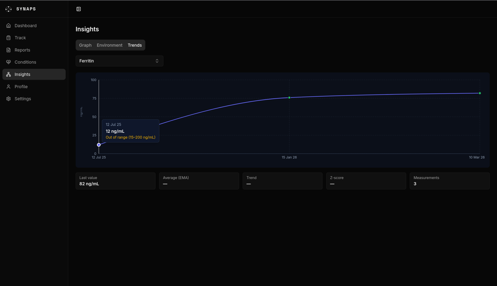

<p align="center">
  <picture>
    <source media="(prefers-color-scheme: dark)" srcset="logo-dark.svg">
    
  </picture>
  <br>
  <strong>SYNAPS</strong>
</p>

<p align="center">Self-hosted personal health monitor to see the body as complex graph</p>

<p align="center">
  <a href="LICENSE">CC BY-NC-SA 4.0</a>
</p>

---

> **Not a medical device.** Synaps is a personal data aggregation tool. Nothing it shows: correlations, trends, AI analysis, or allostatic load scores constitutes medical advice or diagnosis. Always consult a qualified healthcare professional for any health issue. I assume no liability for decisions made based on information displayed by this software.

---

## Background

A few years ago I built a small personal project, basically an health log. It's nothing fancy, just a place to store the things I find interesting to monitor about myself: blood tests, sleep, how I feel during the day. I like having a place where I can look at my own system as a whole, instead of scattered notes and PDF reports I'll never open again

Two years ago I started studying statistics as part of a master's degree I'm taking, and at some point I thought: How can I apply all this things I'm learning? This project was one of the first things that came to my mind, so I started reading papers about sleep and inflammation, about how biomarkers correlate with lifestyle, about statistical models for personal data. The more I read the more I realized there's actually a lot of interesting science behind the things I was already tracking

So I decided to take advantage of the AI tools, refactor part of the backend and add some simple and nice UI to it. My idea was to build a mathematical model, a weighted network, that connects biomarkers, conditions, lifestyle factors and environment, and from that graph try to infer in a somewhat deterministic way what's going on and what could be improved. It's not perfect and there's a lot I still want to improve, but I think it works well enough to be useful and I also have a feeling that many people may find it kinda useful

**One thing I want to be VERY CLEAR about:** this is not medical advice, it is not a diagnostic tool, and it should never replace a doctor. It's a personal monitoring tool and an exercise in applied statistics. All the papers and references that informed the statistical model are linked at the bottom of this page.

## What it is

Synaps aggregates medical reports, daily lifestyle data, and environmental conditions into a single knowledge graph. An AI (Claude) reads the whole picture and finds correlations across domains: not just within them.

Single-user, open source, runs entirely on your own hardware.

## Screenshots

<table>
<tr>
<td></td>
<td></td>
</tr>
<tr>
<td align="center"><em>Dashboard: AI reminders, quick stats, recent reports</em></td>
<td align="center"><em>Knowledge Graph: biomarkers, conditions, lifestyle, medications</em></td>
</tr>
<tr>
<td></td>
<td></td>
</tr>
<tr>
<td align="center"><em>Reports: tagged, searchable medical history</em></td>
<td align="center"><em>Report detail AI analysis + color-coded biomarker table</em></td>
</tr>
<tr>
<td></td>
<td></td>
</tr>
<tr>
<td align="center"><em>Conditions: active and resolved, with timeline</em></td>
<td align="center"><em>Sleep log: nightly hours and quality rating</em></td>
</tr>
<tr>
<td></td>
<td></td>
</tr>
<tr>
<td align="center"><em>Trends: biomarker time series with EMA and z-score</em></td>
<td></td>
</tr>
</table>

## What it tracks

| Domain | Data |
|--------|------|
| **Medical reports** | Lab results, biomarkers, uploaded PDFs/photos: extracted by AI |
| **Sleep** | Hours slept, quality (1–5), nightly notes |
| **Diet** | Meals, calories, macros (protein / carbs / fat) |
| **Activity** | Type, duration, intensity (1–5): MET-weighted volume |
| **Wellbeing diary** | Energy (1–5), mood (1–5), pain (0–10), pain area, free notes |
| **Body** | Weight (kg), body fat (%), waist circumference (cm) |
| **Conditions** | Diagnoses, dates, current vs. resolved |
| **Medications** | Active medications, dosage, frequency |
| **Environment** | Temperature, humidity, AQI, PM2.5, PM10, UV: via Open-Meteo |

## Statistics computed

All metrics are updated incrementally as you log data, using time-aware exponential smoothing (EWMA with continuous-time decay).

**Per metric: long-τ EMA, short-τ EMA, variance, trend direction, z-score**

| Domain | τ (half-life) | Key metrics |
|--------|--------------|-------------|
| Wellbeing | 6.2 days | energy, mood, pain, composite score |
| Sleep | 9.5 days | hours slept, quality, cumulative deficit |
| Diet | 13.5 days | daily calories, protein/carb/fat ratio |
| Activity | 19.5 days | MET-weighted volume, weekly minutes, intensity |
| Body | 19.5 days | weight, body fat %, waist circumference |
| Biomarkers | 62.4 days | any lab value extracted from reports |

**Cross-domain correlations**: Pearson r across domains (sleep, wellbeing, activity, diet, body) with lags 0, 1 and 2 days. Minimum 45 co-observations required. Autocorrelation is corrected via effective N: `nEff = n × (1 − r₁) / (1 + r₁)` where r₁ is the lag-1 autocorrelation of the series. Multiple comparisons corrected with Benjamini-Hochberg FDR (α = 0.05).

**Trend detection**: short-τ EMA (τ/3) vs. long-τ EMA. If the difference exceeds 20% of the rolling standard deviation the metric is marked increasing or decreasing

**Allostatic load**: normalized count of biomarker risk flags: CRP > 3 mg/L, HDL < 40 mg/dL, HbA1c > 6.5 %, waist-to-height ratio > 0.5. Score = risk flags present / biomarkers available, range 0–1. Concept from Gustafsson et al. 2023 (17-cohort IPD meta-analysis)

**Health graph**: Claude maps all data into typed nodes (biomarker, condition, lifestyle, environment, medication, report) and weighted edges. Linear regression on biomarker time series validates edge directions before they are stored

## How the model works

### Exponential weighted moving average (EWMA)

Each metric is tracked as a continuous-time exponential moving average. When a new observation arrives after Δt days:

```
α      = 1 − exp(−Δt / τ)
EMA    = α × value + (1 − α) × EMA_prev
emVar  = α × (value − EMA)² + (1 − α) × emVar_prev
```

`emVar` (exponential moving variance) enables real-time z-score computation and trend detection. A short-τ EMA (τ/3) compared to the long-τ EMA determines trend direction: if `shortEMA > longEMA + 0.2σ` the metric is marked increasing.

### Within-person cross-domain correlations (N-of-1)

Daily observations across domains (sleep, wellbeing, activity, diet, body) are joined by date and analysed using Pearson r with lags of 0, 1 and 2 days. Minimum 45 co-observations required per pair. Because measurements are autocorrelated and we run many tests simultaneously, two corrections are applied:

- **Autocorrelation**: effective N is computed as `nEff = n × (1 − r₁) / (1 + r₁)` where r₁ is the lag-1 autocorrelation of the series. The Pearson t-test and confidence interval are then evaluated at nEff instead of n.
- **Multiple comparisons**: Benjamini-Hochberg false discovery rate correction (α = 0.05) across all tested pairs and lags

Results are labelled by confidence tier: *low* (n < 60), *moderate* (60–120), *high* (> 120). All findings are presented as correlational signals, not causal relationships — individual within-person patterns frequently diverge from population-level meta-analyses (Myin-Germeys et al.).

### Allostatic load

A normalised count of biomarker risk flags based on the 17-cohort IPD consensus (Gustafsson et al. 2023): CRP > 3 mg/L, HDL < 40 mg/dL, HbA1c > 6.5 %, waist-to-height ratio > 0.5. Score = risk flags present / biomarkers available, range 0–1. Only flags for which data is available are included in the denominator.

### Knowledge graph

Claude maps all structured data into typed nodes and weighted edges. Edge weights are validated against the statistical correlations computed above: an AI-inferred edge is down-weighted if the Pearson r for that pair is low or insignificant.

## Install

Requires Docker with Compose v2

```bash
curl -fsSL https://raw.githubusercontent.com/scerelli/SYNAPS/refs/heads/main/install.sh | bash
```

The script:
1. Checks Docker and git are available
2. Clones the repo to `/opt/synaps` (override with `SYNAPS_DIR=/your/path`)
3. Creates a pre-configured `.env` (auto-generated encryption key)
4. Asks for the port (default 80) and whether to disable auth (for users behind a reverse proxy)
5. Builds and starts all services with `docker compose up -d --build`

Re-running the script on an existing installation does a `git pull` and rebuilds — no data is lost.

All services use `restart: unless-stopped`: on a Linux server with Docker set to start on boot, Synaps comes back up automatically after a reboot with no extra configuration needed.

### Access from outside your LAN

I suggest to install [netbird](https://netbird.io) on your server/machine and on your phone. Once peered, open Synaps at the server's Netbird IP directly: no port forwarding, no public exposure.

### Update

```bash
cd ~/synaps && docker compose pull && docker compose up -d --build
```

---

## References

- **EWMA with continuous-time decay**: Feltz-Cornelis et al. (2023), PMC10248291; CDC NSSP Rnssp package
- **Allostatic load**: Gustafsson et al. (2023), 17-cohort IPD consensus meta-analysis, PMC10620736
- **Physical activity MET values**: WHO Physical Activity Guidelines; Ainsworth Compendium of Physical Activities (2024 update)
- **Sleep <> CRP**: Irwin et al. (2016), PMC4666828
- **Activity <> lipids**: Meta-analysis of 148 RCTs, Sports Medicine (2024)
- **N-of-1 within-person correlations**: Myin-Germeys et al., Experience Sampling Method; Van den Berg et al. (2017), *Behavior Research Methods*, doi:10.3758/s13428-016-0799-x
- **False discovery rate correction**: Benjamini & Hochberg (1995), *JRSS-B* 57(1):289–300
- **Personal science methodology**: Larson et al. (2023), *npj Digital Medicine* 6:107
- **Lag effects: sleep → inflammation**: Prather et al. (2021), *Psychosomatic Medicine* 83(7):669–676
- **Exercise → mood (meta-analysis)**: Schuch et al. (2018), *JAMA Psychiatry* 75(6):566–576

---

## Possible future improvements

Things I'd like to explore but haven't implemented yet:

- **Structured sleep quality (RU-SATED)** — replace the simple 1–5 quality slider with the 6-dimension RU-SATED questionnaire (Regularity, Satisfaction, Alertness, Timing, Efficiency, Duration), which gives a more clinically meaningful sleep score. Buysse (2014), PMC6452900; cross-cultural validation: Furihata et al. (2022), *Sleep Medicine* 91:109–114, PMID 35303631.
- **Dietary quality index (HEI-2020)** — compute the USDA Healthy Eating Index from logged meals instead of just tracking raw calories and macros. Would require more structured food logging. PMC6719291.
- **Bayesian biomarker estimation** — replace the EWMA point estimate with a conjugate normal–normal model that maintains a full posterior distribution over each biomarker. This would give proper uncertainty intervals and handle sparse lab data better. Murphy, UBC conjugate normal; Gong et al. (2024), PMID 38855634.
- **Changepoint detection (BOCPD)** — replace the short/long EMA trend heuristic with Bayesian Online Changepoint Detection to identify structural shifts in time series (e.g. a sudden sustained change in a biomarker after a medication change). Adams & MacKay (2007).
- **Local AI via Ollama** — test whether open-weight models running locally can produce comparable graph builds and reminders to Claude, for full offline/private operation.


